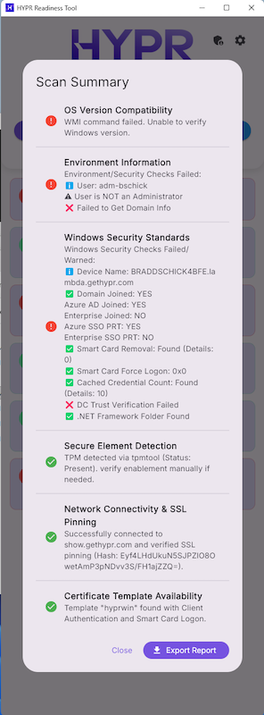
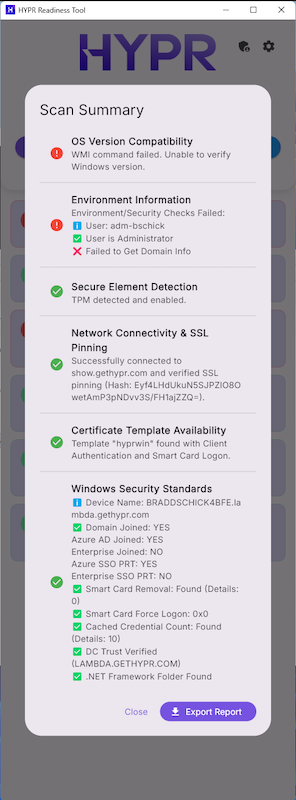

# HyprReadiness Tool

The HyprReadiness Tool is a cross-platform Flutter application designed to verify if a machine meets the requirements for HYPR deployment. It performs a series of system, network, and security checks on both macOS and Windows.

## Deployment Prerequisites

### Supported Operating Systems
- **macOS**: 13 (Ventura), 14.1+ (Sonoma), or 15+ (Sequoia)
- **Windows**: Windows 10 Pro or Windows 11 Pro

---

## Checks Performed

The tool runs the following categories of checks. Some are OS-specific.

### Common Checks
- **OS Version Compatibility**: Verifies the operating system version matches the supported versions listed above.
- **Network Connectivity**: 
  - Connects to `show.gethypr.com` via HTTPS.
  - **SSL Pinning**: Validates the server's public key hash against known valid pinnings to ensure a secure, intercepted-free connection.
- **Certificate Template Availability**: (Interactive)
  - Connects to a specified Active Directory Certificate Services (ADCS) server.
  - Submits a test CSR (Certificate Signing Request).
  - Verifies the issued certificate contains required Extended Key Usages (EKUs):
    - Client Authentication (`1.3.6.1.5.5.7.3.2`)
    - Smart Card Logon (`1.3.6.1.4.1.311.20.2.2`)

### macOS Specific Checks
- **Secure Element Detection**: 
  - Verifies presence of **Apple Silicon** or **T2 Security Chip** (Secure Enclave).
  - Warns if running on Intel hardware without a T2 chip.
- **Environment Information**:
  - **FileVault**: Verifies Full Disk Encryption is ON.
  - **Personal Recovery Key**: Checks if a personal recovery key exists (requires Admin).
  - **Recovery Key Usage**: Verifies the system is NOT currently using the recovery key for login.
  - **Plist Configuration**: Checks specific system preferences:
    - Screen Saver Token Removal (`tokenRemovalAction = 0`)
    - Automatic Login (Disabled)
  - **AD Binding**: Checks `dsconfigad` for Directory Domain binding.
  - **JAMF**: Reports the configured JAMF JSS URL.

### Windows Specific Checks
- **Secure Element Detection**:
  - Verifies **TPM (Trusted Platform Module)** is detected and enabled via WMI.
- **Windows Security Standards**:
  - **Device Status**: Checks `dsregcmd /status` for:
    - Domain Joined
    - Azure AD Joined
    - Enterprise Joined
    - SSO PRT Status (Azure/Enterprise)
  - **Registry Policies**:
    - Smart Card Removal Policy (`ScRemoveOption`)
    - Smart Card Force Logon (`scforceoption`)
    - Cached Credential Count (`CachedLogonsCount`)
  - **DC Trust**: Verifies Domain Controller trust using `nltest /SC_VERIFY:%USERDNSDOMAIN%`.
  - **.NET Framework**: Verifies the presence of the .NET Framework folder.

---

## Headless Execution

The tool supports a headless mode for automated diagnostics (e.g., boot-time checks) where no user interface is displayed. Results are written directly to a log file.

### Usage

Run the executable with the `--headless` flag:

**macOS:**
```bash
./hyprready.app/Contents/MacOS/hyprready --headless
```

**Windows:**
```powershell
.\hyprready.exe --headless
```

### Logging

By default, logs are written to the system's temporary directory:
- **Windows**: `%TEMP%\hyprready_headless.log`
- **macOS/Linux**: `/tmp/hyprready_headless.log`

To specify a custom log file location, use the `--log-file` argument:
```bash
hyprready --headless --log-file "C:\Logs\startup_check.log"
```

### Configuration (`hyprready.json`)
You can configure the headless execution by placing a `hyprready.json` file in the same directory as the application executable.

**Supported Properties:**
- `targetUrl`: The hostname to pin SSL against (e.g., `custom.hypr.com`). **Do not include `https://`.**
- `adcsServer`: The FQDN of the ADCS server for certificate checks.
- `certTemplate`: The name of the certificate template to request.

**Example `hyprready.json`:**
```json
{
  "targetUrl": "custom.hypr.com",
  "adcsServer": "pki.corp.example.com",
  "certTemplate": "UserAuth"
}
```
*Note: If the configuration file is missing, the tool will use default values and skip the interactive Certificate Template check.*


## Boot Task Management (Windows & macOS)

The application allows you to schedule a self-diagnostic task to run automatically at system boot (before user login). This is useful for capturing the state of the machine immediately upon startup.

### Managing via GUI
1.  **Administrator Access**:
    - **Windows**: Right-click `hyprready.exe` and "Run as administrator".
    - **macOS**: Launch the app normally. You will be prompted for your password when installing/removing the daemon.
2.  **Open Task Manager**: Click the Admin Shield icon in the top-right corner of the application window.
3.  **Install/Remove**:
    - Configure the **Log File Path** and **Boot Delay** (seconds), then click **Install Task/Daemon**.
    - If already installed, click **Remove Task/Daemon** to unregister.

### Managing via CLI
You can also manage the scheduled task of daemon via CLI. **Administrator/Root privileges are required.**

#### Install
**Windows**:
```powershell
hyprready.exe --install-task --log-file "C:\Temp\boot.log" --boot-delay 10
```

**macOS**:
```bash
sudo ./hyprready.app/Contents/MacOS/hyprready --install-daemon --log-file "/tmp/boot.log" --boot-delay 10
```

#### Remove
**Windows**:
```powershell
hyprready.exe --remove-task
```

**macOS**:
```bash
sudo ./hyprready.app/Contents/MacOS/hyprready --remove-daemon
```


This project is built with [Flutter](https://flutter.dev/).

### Prerequisites
- **Flutter SDK**: [Install Flutter](https://flutter.dev/docs/get-started/install)
- **Git**: For cloning the repository.
- **Visual Studio** (Windows): Required for Windows desktop development (C++ workload).
- **Xcode** (macOS): Required for macOS desktop development.

### Setup and Run

1. **Clone the repository:**
   ```bash
   git clone <repository_url>
   cd hyprready-tool-flutter/hyprready
   ```

2. **Install dependencies:**
   ```bash
   flutter pub get
   ```

3. **Run the application:**
   - **macOS:**
     ```bash
     flutter run -d macos
     ```
   - **Windows:**
     ```bash
     flutter run -d windows
     ```

### Building for Production

To create a release build (executable/app bundle):

- **macOS:**
  ```bash
  flutter build macos --release
  ```
  The application bundle will be found in `build/macos/Build/Products/Release/hyprready.app`.

- **Windows:**
  ```bash
  flutter build windows --release
  ```
  The executable will be found in `build/windows/runner/Release/hyprready.exe`.

## Project Structure

- `lib/checks/`: Contains the logic for individual system checks.
- `lib/ui/`: Contains the user interface code (screens and widgets).
- `lib/utils/`: Helper utilities (e.g., command execution).
- `macos/`: macOS native configuration and runner code.
- `windows/`: Windows native configuration and runner code.

## Troubleshooting

- **"Failed to run dsregcmd" (Windows)**: Ensure you are running the application with appropriate permissions, although standard user rights should suffice for status reads.
- **"Missing Personal Recovery Key" (macOS)**: This check attempts to escalate privileges using `osascript`. If you deny the admin prompt, the check will skip or fail.
- **SSL Pinning Failures**: Ensure you are not behind a corporate proxy that performs SSL termination/inspection without the appropriate root CA, or that the `show.gethypr.com` certificate has not rotated to a key not in the pinning list.

### Windows Troubleshooting

Most errors when running the app on Windows are related to permissions. Ensure you are running the application with appropriate permissions, although standard user rights should suffice for most checks. If you are seeing errors related to running the app, try running the application as an administrator.

 
